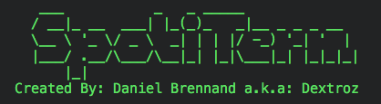

# SpotiTerm


A Terminal Interface to interact with Spotify's Web API.

## Disclaimer
This is my first project I have ever uploaded to Github, so please keep this in mind if I'm a little slow, still learning the flow of the website and open to feedback. Furthermore, I'm currently in academic studies so I do not have a lot of free time. Thanks, Dextroz.

This is a entertainment project for me, as I'm an avid Spotify user!

## Current Features
  1. Track Search; Open track URL in browser.
  2. Artist Top Tracks; Given artist name.
  3. Get the user's top tracks (Short and Long term).
  4. Get the user's top artists (Short and Long term).
  5. Show user's playlists, total tracks for each playlist, artist and track name.
  6. Add -- Delete track(s) from a given playlist. Both public and private playlists supported.
  7. Player Controls -- **Requires a premium Spotify account.**

### Future Features -- Changes in mind
  1. Track audio analysis.

## Dependencies
SpotiTerm is written in Python 3 so it is **REQUIRED**.

SpotiTerm requires the following dependencies:
  1. * [Spotipy](https://github.com/plamere/spotipy) - A light weight Python library for the Spotify Web API.
  2. * [Hue](https://github.com/UltimateHackers/hue) - Provides a minimal and powerful interface to print coloured text and labels in the terminal.

## Prerequisites
To operate SpotiTerm you must:

  1. Have a **Spotify** Account.

  1. Go to Spotify's developer website and [create an application](https://beta.developer.spotify.com/dashboard/login).

  2. Go to your applications settings and add you're preferred redirect URI (I chose "http://localhost:8888").

  3. Navigate to you're apps dashboard and copy the Client ID and Client Secret.

  4. Place **Client ID**, **Client Secret** and **Redirect URI** in the respective variables found in [config.py](functions/config.py):
      ```
      CLIENT_ID = "Insert Client ID Here."
      CLIENT_S = "Insert Client Secret Here."
      REDIRECT_URI = "Insert Redirect URI Here."
      ```
### Recommended
To enjoy the full beauty of SpotiTerm, I recommend the use of a dark terminal theme.
[OSX Terminal Themes](https://github.com/lysyi3m/osx-terminal-themes/blob/master/schemes/Darkside.terminal) from [Emil Kashkevich (lysyi3m)](https://github.com/lysyi3m). I recommend the Darkside theme.

## Download Options -- Installing
Currently you can only clone or download the project ZIP file. (Recommended clone if you're going to be contributing.)

Extract and navigate to the zipfile directory and run SpotiTerm by executing the main entry point file (SpotiTerm.py):
  ```
  python3 SpotiTerm.py
  ```

## Authors -- Contributors

* **Daniel Brennand** - *Author* - [Dextroz](https://github.com/Dextroz)

## License

This project is licensed under the MIT License - see the [LICENSE](LICENSE) for details.

## Acknowledgments
* This project started with me just wanting to see if I could make a script, to enter a track name and automate it to open said track in a browser (Google Chrome) however, I decided to add more functionality, got carried away and now it has a few interesting features. I am happy with its current features so I have decided to upload it.
* Spotipy created by [Paul Lamere (plamere)](https://github.com/plamere) and respective contributors.
* Hue created by [Somdev Sangwan (UltimateHackers)](https://github.com/UltimateHackers) and respective contributors.
